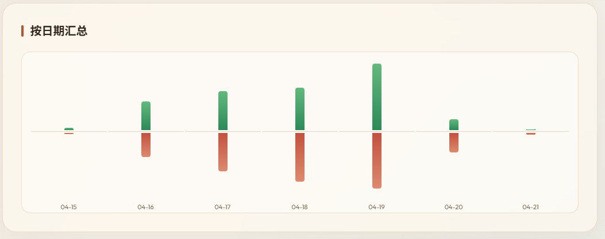

# RocoKingdom-ItemUsageChecker

通过 `mitmproxy` 抓取《洛克王国：世界》客服中心的「道具流水」数据，并生成本地可视化页面，方便查看详细流水和统计精灵球用量。

# 粉星仔异色吃我4000多球，一气之下写此工具。



## 功能
自动拉取道具流水List
内置Web页面可查看详细信息与可视化精灵球用量

## 使用方法

确保你 **安装并信任了 mitmproxy 证书**

```bash
pip install mitmproxy
python checkballs.py
```

## 打包为 EXE

```powershell
./build_exe.ps1
```

或直接双击 `build_exe.cmd`。

说明：
- 默认生成 `dist/RocoKingdom-ItemUsageChecker/`，这是免 Python 依赖的可分发目录
- 实际分发时请带上整个目录，不要只拿里面的 `exe`
- 如果你确实想打成单文件，也可以运行 `./build_exe.ps1 -OneFile`

1. 运行checkball.py
2. 按照屏幕上的教程提示操作：
   - 打开游戏内客服中心
   - 选择「道具」→「道具流水」
   - 等待工具自动获取全部流水数据
   - 获取开始后可手动关闭客服页面
3. 获取完成后浏览器会自动打开结果页面

## 提示
- 在手动打开流水页面后工具会自动开始获取，期间你可以关闭游戏客服页面，但不要关闭工具

- 由于腾讯的流水页面限制了list大小只有15每页，所以获取时间会与你道具使用成正比（然后腾讯每一个道具都要写一行，你扔99个球就是99行数据，无语。）
当前每秒请求一次的情况下，例如用户拥有20000条数据，那么则需要1333秒（理想情况下，现实可能会出现访问人数过多导致重试的情况）也就是22分钟左右。
在更新后，初次拉取会并发同时获取20页，大大的加速了获取速度。并使用指数退避算法来防止访问冷却。

### 目前对于洛克王国世界的道具流水列表机制尚不明确，初步推测api会返回账号全部道具流水，列表大小会跟着用户游玩时间进行指数上升，可能会导致未来很难拉取道具信息。

## 注意事项

- 首次使用需在浏览器访问 `http://mitm.it` 安装 mitmproxy 证书
- 工具会临时修改系统代理设置，退出后自动恢复
- 抓取结果保存在 `full_list.json`


## 技术细节

- 使用 mitmproxy 作为代理框架
- 通过修改注册表设置系统直连代理（`127.0.0.1:8080`）
- 自动处理 gzip/deflate 压缩响应
- 退出时自动恢复原始代理设置
- 100% VibeCoding （AI真的太好用了你知道吗）
- 使用指数退避算法进行重试以防止请求冷却
- 本地缓存进度，之后只拉取更新数据

## 提示
虽然理论上没有涉及到游戏内容的修改，读取，工具涉及的信息都应与腾讯客服有关而不是游戏，但具体情况下，使用本工具仍可能违反《洛克王国：世界》的服务条款，包括但不限于：警告，封号 等
本工具100%由AI完成，如果触及了您的利益，您可以提交issue或DMCA来下架此工具，本人将积极配合工作。
（叠甲：用的腾讯CodeBuddy）
使用本工具则代表您已了解上述风险

本工具可能会造成腾讯客服服务器压力增大，所以原则性不推荐推广此工具。
本工具仅供学习和研究使用。使用前请自行评估相关风险，并确认符合你所在环境的使用规范。
